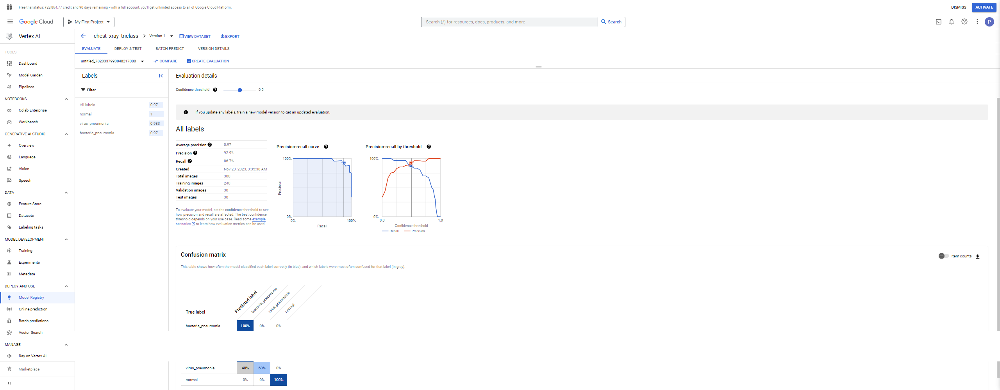
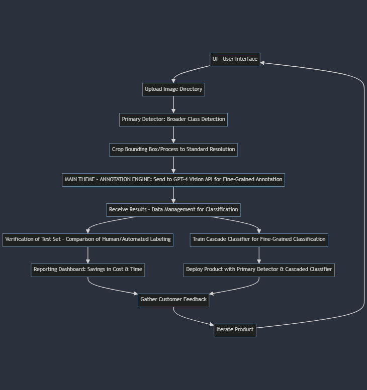
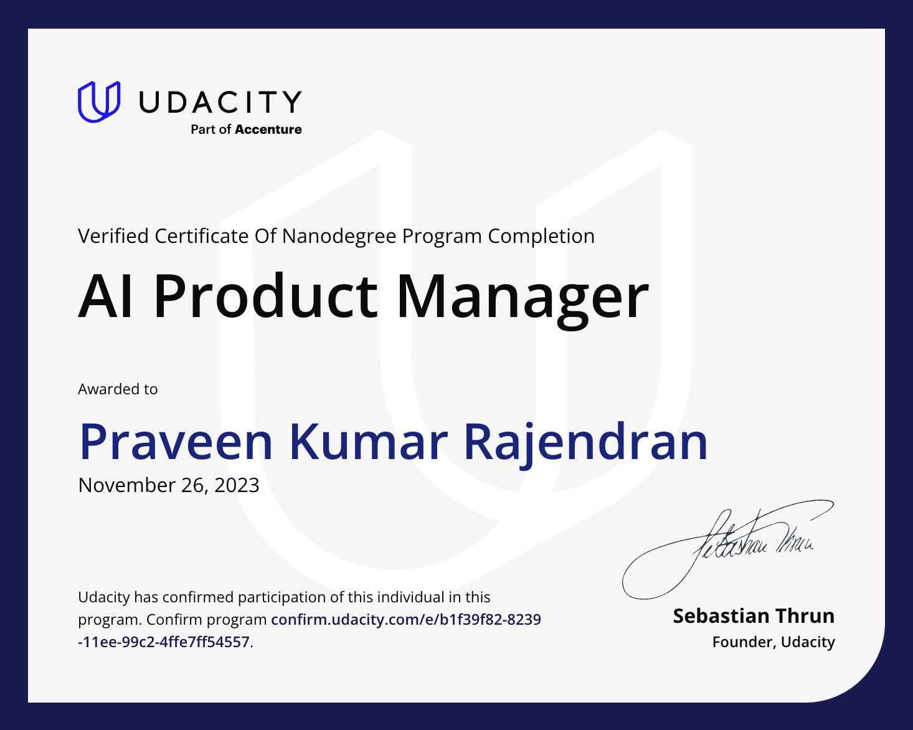

# Udacity AI Product Manager Nanodegree Program Projects

## Projects

[AI Product Manager - Syllabus](https://cdn.sanity.io/files/tlr8oxjg/production/cee60711067ebd02acc144994cf4b1b1bad74dc3.pdf)

### 01. [Create a Medical Image Annotation Data Set with Appen](01_AIPMND_Project1-Create-Dataset)

  
Description

    Implemented a comprehensive medical image annotation dataset job in the platform of Appen.

### 02. [Build a Model with Google AutoML](02_AIPMND_Project2_Build-Model)

  
Description

    Implemented a machine learning model using Google AutoML for automated model training and deployment.

### 03. [Capstone Proposal - AI Product](03_AIPMND_Project3_AI-Product-Business-Proposal)

  
Description

    Developed a comprehensive AI product business proposal for the Capstone project.

## Udacity - Graduation Certificate

